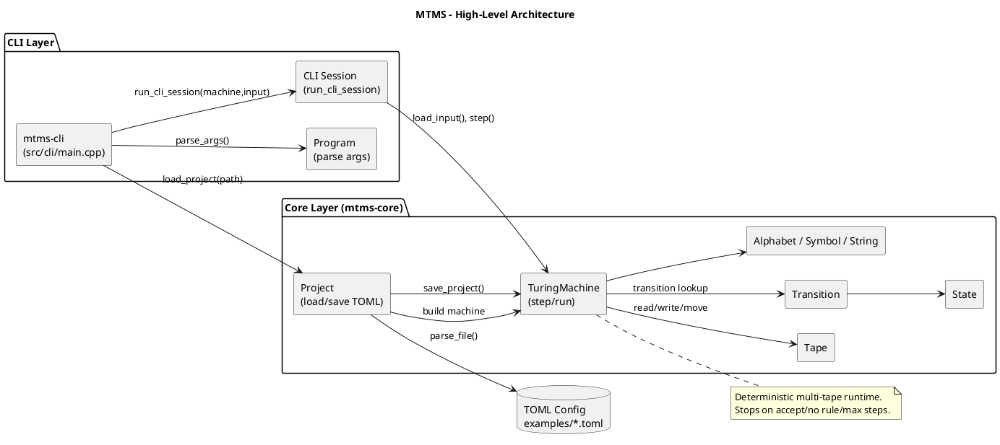
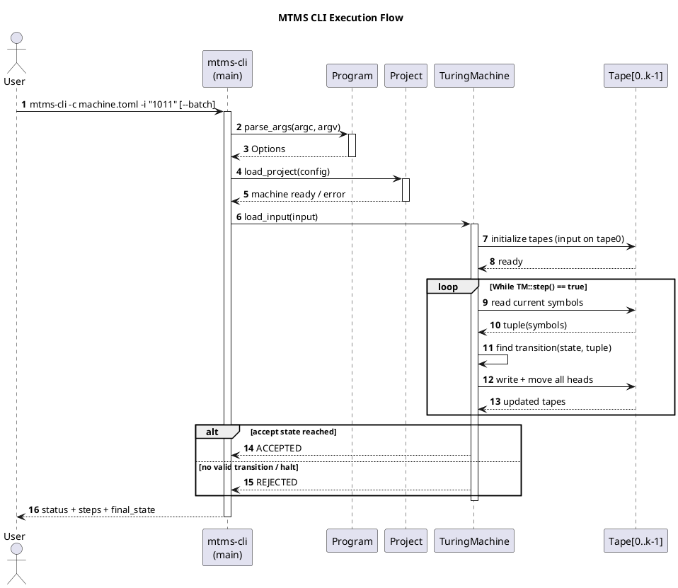

# MTMS Architecture

This document uses **PlantUML** blocks so the architecture can be rendered in GitHub Pages pipelines that support PlantUML conversion.

## Static architecture (component/class view)

## Execution flow (sequence "animation-ready" diagram)

